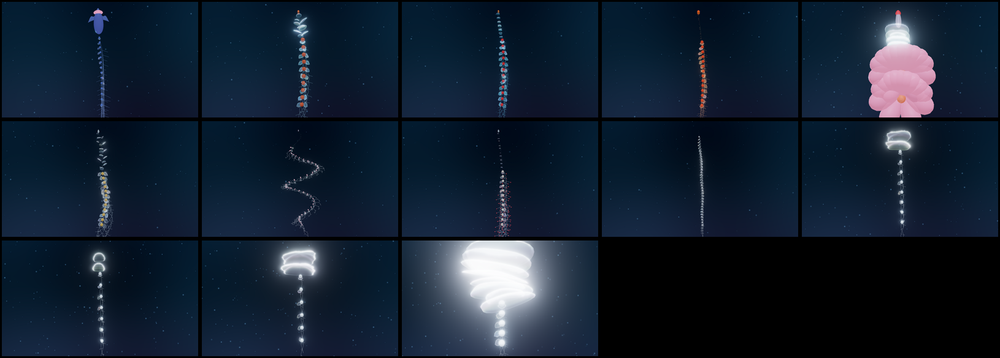

# 🪼 Siphonophores — a parametric colony

A real-time, biologically-grounded **siphonophore** in Three.js. One procedural
colony rig spans **Portuguese man o' war → Nanomia → Agalma → Marrus → Physophora
→ Forskalia → Apolemia → Erenna → Praya → Diphyes → Chelophyes → Abylopsis →
Hippopodius** — all three suborders — and every one is the same rig at a different
point in one parameter space.

Siphonophores are the ocean's argument that "individual" is a slippery word: each
one is not an animal but a **colony** of genetically identical, physiologically
integrated zooids, each a specialized body budded from a single founder — some
swim, some feed, some sting, some reproduce, some are just transparent shields.
This toy treats that colony as what it structurally is: **an ordered chain of
modules along a stem**, and lets you slide between species by moving through the
space of possible chains.



*All thirteen are the same rig at different coordinates — cystonect (man o' war) ·
physonects (Nanomia, Agalma, Marrus, Physophora's hula skirt, Forskalia, Apolemia's
coil, Erenna's red lures) · calycophores (Praya, Diphyes, Chelophyes, Abylopsis,
glassy Hippopodius). Regenerate with `npm run render` while the server runs.*

Built to look right in **black water** — the deep-sea / blackwater-dive setting
where these are most beautiful — which is also a rendering gift: on black, the
gelatinous parts are drawn *additively*, so two dozen overlapping translucent bells
and bracts compose correctly with no depth-sorting and no z-fighting, and
bioluminescence just adds light on top.

## Run it

```bash
npm install      # three + lil-gui
npm start        # static server on http://localhost:5180
```

Open the URL. Orbit with the mouse; tap a species chip; open **controls** to move
through the parameter space by hand. No build step — the browser loads ES modules
directly.

```bash
npm run smoke    # Node: builds + poses every species' colony, checks for NaNs
npm run render   # headless Chromium: screenshots every species to /tmp/sipho_*.png
npm run build    # bundle a self-contained dist/ for deployment
```

## The parameter space

A colony is organised apex → tip along a central **stem**:

```
pneumatophore (gas float)  →  nectosome (column of swimming bells)  →
siphosome (a repeated series of cormidia: gastrozooid + tentacle,
           palpons, bracts, gonophores)
```

The three suborders are just **which regions exist**:

| Suborder | Float | Nectosome | Example |
|---|---|---|---|
| **Cystonectae** | big float, sets orientation | **none** | Portuguese man o' war |
| **Physonectae** | small float | column of bells | Nanomia, Marrus, Apolemia |
| **Calycophorae** | **none** (oil buoyancy) | 1–2 (or stacked) bells | Praya, Diphyes, Hippopodius |

Everything else is continuous. `src/core/params.js` is the whole space; each entry
in `src/species/presets.js` overrides only the leaves that make a species itself.
`morphParams()` blends two colonies (structural counts round to whole numbers so a
blend rebuilds cleanly), so you can slide a man o' war into a Nanomia.

- **Stem** — length, lateral bow, **coil** (Apolemia's UFO spiral), sag.
- **Float** — present?, size, apex taper, **sail crest** (Physalia), apical pigment
  cap (Marrus orange, Agalma/Nanomia red).
- **Nectosome** — bell count, **arrangement** (biserial / spiral / single / none),
  column length, bell shape (**round ↔ prismatic** via a superellipse exponent,
  apex taper, mouth constriction), and the **pulse** (rate, depth, metachronal
  wavelength, biserial stagger).
- **Siphosome** — cormidium count, and per-cormidium the gastrozooid, the
  **tentacle** (length, tentilla side-branches, curl, **bioluminescent lure**),
  the **palpon skirt** (Physophora's hula skirt), and the **bracts** (count, shape,
  shingling).
- **Appearance** — gel tint, fresnel rim glow, interior fill, iridescence,
  bioluminescence intensity + colour.
- **Glow & shimmer** — bloom (the deep-sea halo), an animated **comb-jelly
  iridescent shimmer** (a spectral sheen that drifts over the gel), and a
  **cephalopod-style colour ripple** (travelling bands of glowing colour sweeping
  down the body). Leaning slightly cartoony on purpose — the aim is the *feeling* of
  swimming with these, not a museum plate.

The whole colony also **drifts in lazy spiralling arcs** and turns slowly, hanging
alive in a black water rich with twinkling marine snow — rather than posed stiff.

## How it's built

```
src/
  core/
    math.js       superellipse, smoothstep, deterministic RNG, tree-lerp (morphing)
    params.js     THE parameter space: defaults() + morphParams()
  species/
    presets.js    13 real specimens as points in that space
  rig/
    stem.js       the central stem space-curve (bow / coil / sag) + a frame at any s
    nectophore.js parametric swimming bell: superellipse cross-section, apex→mouth
    zooids.js     float, sail crest, gastrozooid, bract, tentacle+tentilla builders
    SiphonophoreRig.js  assembles float+nectosome+siphosome; metachronal pulse update
  shading/
    GelMaterial.js  additive fresnel-rim gel (order-independent on black),
                    self-lit organ material, PBR float, bioluminescent lure points
  scene/
    environment.js  black water: faint downwelling gradient, soft key, marine snow
  main.js         renderer, camera framing, GUI, species chips, render loop
```

### Design decisions worth knowing

- **Additive gel on black = free order-independent transparency.** A colony stacks
  dozens of overlapping translucent shells (bells, bracts). Sorting them per-frame
  would be a mess and still z-fight. Drawn additively against a near-black
  environment, overlaps simply accumulate light — which is also physically what a
  glowing gelatinous animal in the deep looks like.
- **The float sits *above* the stem, not *on* it.** An early bug had the float's
  size fraction eating half the stem's arclength, leaving a dead gap before the
  feeding zooids. The float is anchored at the apex and rises above it; the stem
  arclength [0,1] is entirely nectosome + siphosome.
- **The pulse is a travelling wave, apex → base.** Each bell contracts on its own
  phase, offset down the column, so the nectosome ripples instead of pulsing in
  unison — matching how the wave is initiated by the youngest (apical) bells and
  travels toward the older ones. Contraction is a fast squeeze + slow refill.

## The biology (and where it came from)

Morphology, arrangement, colour, and locomotion are synthesised from the primary
literature — chiefly **Mapstone 2014, *Global Diversity and Review of
Siphonophorae* (PLOS ONE, [PMC3916360](https://pmc.ncbi.nlm.nih.gov/articles/PMC3916360/))**;
the **Church / Siebert / Dunn histology of *Nanomia bijuga*
([PMC5032985](https://pmc.ncbi.nlm.nih.gov/articles/PMC5032985/))**; the
**Costello / Colin / Sutherland multi-jet propulsion series** (Nature Comms 2015
[ncomms9158](https://www.nature.com/articles/ncomms9158); JEB 2019 "Propulsive
design principles" [jeb198242](https://journals.biologists.com/jeb/article/222/6/jeb198242/20717/);
JEB 2023 nectophore coordination [jeb245955](https://journals.biologists.com/jeb/article/226/18/jeb245955/329517/));
**Munro & Dunn on *Physalia* ([PMC6820529](https://pmc.ncbi.nlm.nih.gov/articles/PMC6820529/))**;
the **tentilla-evolution paper ([PMC8331849](https://pmc.ncbi.nlm.nih.gov/articles/PMC8331849/))**;
**Haddock, Dunn, Pugh & Schnitzler 2005** on *Erenna*'s red bioluminescent lures
(*Science* 309:263, [MBARI](https://www.mbari.org/news/deep-sea-jelly-uses-glowing-red-lures-to-catch-fish/));
and species pages from **MBARI**, **Monterey Bay Aquarium**, **WoRMS**, and the
**SIO Zooplankton Guide**.

**Locomotion numbers baked in / available to tune** (from *Nanomia bijuga*): ~9
nectophores (range 6–14); pulse cycle ~0.26 s (≈3.9 Hz routine); jet:refill ≈ 1:1;
adjacent bells offset ~45% of a cycle; wave travels apex→base; colony body speed
~160 mm/s (the oft-quoted "~1 m/s" is the *jet* velocity, not the animal); diel
migration of hundreds of metres. Calycophoran escape (Chelophyes) bursts to ~30 cm/s.

**Some things are honest approximations**, flagged during research: exact nectophore
interlock geometry and bract shingle spacing aren't quantified in the literature
(modelled plausibly); *Apolemia*'s dramatic coil is a whole-body posture, not
spiral bell-packing (its bells are a twisted single row — *Forskalia* is the true
spiral); giant lengths (Praya ~40 m, the 2020 Apolemia ~45 m coil / ~119 m
estimated) are ROV estimates. Details in `deploy/DEPLOYMENT.md` and the devlog.

## Where it's going

See [`ROADMAP.md`](ROADMAP.md). Near-term: per-ray tentacle drift and lure
"flicking", a genome-in-URL codec (a colony already *is* its parameter tree, same as
the fish project), and the *Hippopodius* blanch (glassy → milky-white defensive
flash). This is a sibling of the **fish**, **flowers**, and **fruit** parametric
visualizers.
